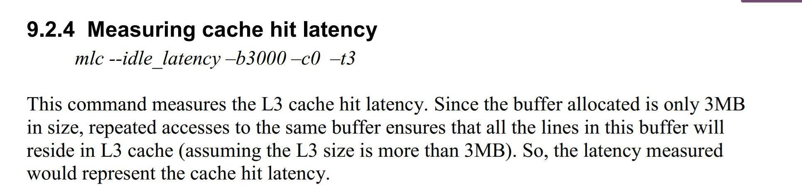

## Intel Memory Latency Checker

https://software.intel.com/en-us/articles/intelr-memory-latency-checker

* Command
```bash
./mlc --idle_latency -b30 -c0  -t3
# 备注： -b buffer size in KiB (default=100000)
# 可以改变 b 参数的大小来设置数据 buffer 大小（比较L1/L2/L3） 的情况来测 L1 L2 L3 延迟。 
# （详见下载包里面的帮助文档。）
```

示例：
<div align="center"></div>

##### 缓存访问延迟问题
* https://www.v2ex.com/t/523069
* https://stackoverflow.com/questions/4087280/approximate-cost-to-access-various-caches-and-main-memory

##### Cache Performance for SPEC CPU2000 Benchmarks
* https://research.cs.wisc.edu/multifacet/misc/spec2000cache-data/

<br>

## morpheus
—— A SKU Emulation tool

##### Prerequisites
* BIOS support for disabling the lock on Package power RAPL MSR. Please refer to Intel SDM.
  Please contact your BIOS Vendor to expose this option in the BIOS.
  For eg. Disabling the lock on Wolfpass SDP BIOS:Package RAPL Limit MSR Lock --> Disable
* Python version 2.7 or higher.
* Install msr-tools:
    * On Ubuntu: apt-get install msr-tools
    * On RedHat/CentOS/Fedora: yum install msr-tools

##### Note
* In order to control TDP you have to limit it using the RAPL registers.
  Section 14.9.1 in Volume 3B of Intel SDM (Software developers manual) lists how this can be done.
  ```
  Basically, setting the PL1 and PL2 levels sets the TDP on the register below (0x610) on SKX and CLX.
  (PL - Power Limit)
  ```

<br>

## Intel® 64 and IA-32 Architectures Software Developer Manuals
* https://software.intel.com/en-us/articles/intel-sdm
