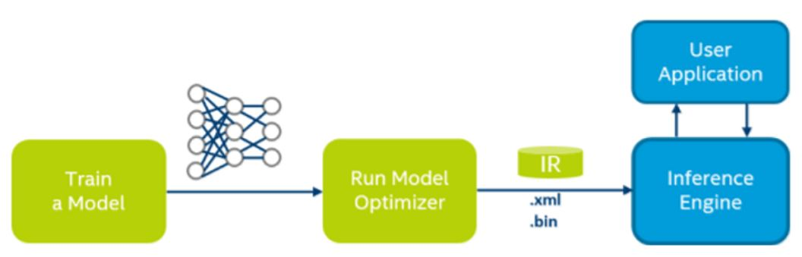

## OpenVINO

*Develop Multiplatform Computer Vision Solutions*

Installation: https://software.intel.com/en-us/articles/OpenVINO-Install-Linux


#### 1. Model Optimizer

*Model Optimizer process assumes you have a network model trained using one of the supported frameworks.* <br>
 <br>

```
* Caffe
* TensorFlow
* MXNet
* Kaldi
* ONNX
```
***It support network models which can be converted to the ONNX* format***

###### 1. (Check) Please configure the Model Optimizer for the framework that was used to train the network. 
```bash
<INSTALL_DIR>/deployment_tools/model_optimizer/install_prerequisites
```
###### 2. Preparing and Optimizing Your Trained Model
* caffe: https://software.intel.com/en-us/articles/OpenVINO-Using-Caffe
* tensorflow: https://software.intel.com/en-us/articles/OpenVINO-Using-TensorFlow
* MXNet: https://software.intel.com/en-us/articles/OpenVINO-Using-MxNet
* ONNX: https://software.intel.com/en-us/articles/OpenVINO-Using-ONNX

###### 3. The layer list varies by framework. For full lists of supported layers for each framework, refer to the following pages:
* Supported Caffe Layers: https://software.intel.com/en-us/articles/OpenVINO-Using-Caffe#caffe-supported-layers
* Supported TensorFlow Layers: https://software.intel.com/en-us/articles/OpenVINO-Using-TensorFlow#tensorflow-supported-layers
* Supported MXNet Layers: https://software.intel.com/en-us/articles/OpenVINO-Using-MXNet#mxnet-supported-layers
* Supported ONNX Layers: https://software.intel.com/en-us/articles/OpenVINO-Using-ONNX#supported-onnx-layers


示例： <br>
**Step 1:** Go to the <INSTALL_DIR>/deployment_tools/model_optimizer directory <br>
**Step 2:** Run the mo_tf.py script with a path to the MetaGraph .meta file to convert a model: <br>
```bash
./mo_tf.py --input_meta_graph <INPUT_META_GRAPH>.meta
./mo_tf.py --input_meta_graph model/model.ckpt.meta --input_shape [1,224,224,3]
```


#### 2. Inference Engine
refer: https://software.intel.com/en-us/articles/OpenVINO-InferEngine

##### Common Workflow for the Inference Engine API
* **Read the Intermediate Representation** - Using the *InferenceEngine::CNNNetReader class*.
* **Prepare inputs and outputs format** - Using the *CNNNetwork::getInputInfo()* and *CNNNetwork::getOutputInfo()*.
* **Select Plugin** - Create the plugin with the *InferenceEngine::PluginDispatcher* load helper class.
* **Compile and Load** - Use the plugin interface wrapper class *InferenceEngine::InferencePlugin* to call the *LoadNetwork()* API to compile and load the network on the device. 
* **Set input data** - With the network loaded, you have an *ExecutableNetwork* object. Use this object to create an *InferRequest* in which you signal the input buffers to use for input and output. 
* **Execute** - 
    * Synchronously - *Infer()* method. Blocks until inference finishes.
    * Asynchronously - *StartAsync()* method. Check status with the wait() method (0 timeout), wait, or specify a completion callback.
* **Get the output** - Do this with the *InferRequest* GetBlob API.

###### 1. Set Your Environment Variables
```bash
# source <INSTALL_DIR>/bin/setupvars.sh
source /opt/intel/computer_vision_sdk/bin/setupvars.sh

# For Windows: PATH=<INSTALL_DIR>\deployment_tools\inference_engine\bin
# \intel64\Debug;<INSTALL_DIR>\opencv\bin;%PATH%
```

###### 2. Building the Sample Applications on Linux* OS
```bash
mkdir build
cd build

cmake -DCMAKE_BUILD_TYPE=Release <INSTALL_DIR>/deployment_tools/inference_engine/samples/

make
```

###### 3. Running the Samples
```bash
./classification_sample -h

./classification_sample -i <path_to_image>/cat.bmp -m <path_to_model>/alexnet_fp32.xml -nt 5 -d GPU

./classification_sample_async -i <path_to_image>/cat.bmp -m <path_to_model>/alexnet_fp32.xml -nt 5 -d HETERO:FPGA,CPU -nireq 2 -ni 200
```


示例：
```bash
# 编译 Inference Engine
mkdir build
cd build
source /opt/intel/computer_vision_sdk/bin/setupvars.sh
cmake -DCMAKE_BUILD_TYPE=Release /opt/intel/computer_vision_sdk/deployment_tools/inference_engine/samples/
make 

# 跑 demo (WorkSpace: build)
cd intel64/Release/
./classification_sample -i dog.jpg -m ../../../ir_models/tf2caffe_tf2mkldnn/model.ckpt.xml -nt 5
```


#### 3. Custom Layer
please refer: https://software.intel.com/en-us/articles/OpenVINO-ModelOptimizer#caffe-models-with-custom-layers
