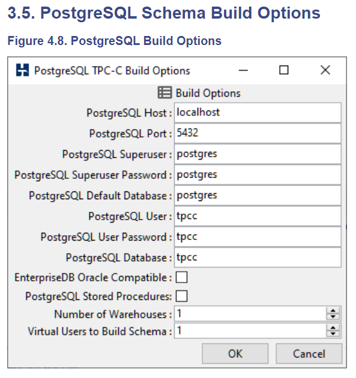

# PostgreSQL Benchmark

- PostgreSQL
- HammerDB

## 介绍

### PostgreSQL
—— https://www.postgresql.org

PostgreSQL 是一个功能强大的开源数据库系统。PostgreSQL 是完全的事务安全性数据库，完整地支持外键、联合、视图、触发器和存储过程（并支持多种语言开发存储过程）。它支持了大多数的 SQL:2008 标准的数据类型，包括整型、数值值、布尔型、字节型、字符型、日期型、时间间隔型和时间型，它也支持存储二进制的大对像，包括图片、声音和视频。

自从 MySQL 被 Oracle 收购以后，PostgreSQL 逐渐成为开源关系型数据库的首选。

#### PostgreSQL 新手入门（非 Benchmark 测试用例！！）

``` bash
$ sudo apt-get install postgresql-client
$ sudo apt-get install postgresql
# 如果还想安装图形管理界面，可以运行下面命令。（不推荐）
$ sudo apt-get install pgadmin3
```
正常情况下，安装完成后，PostgreSQL 服务器会自动在本机的 5432 端口开启。
```
Setting up postgresql-9.3 (9.3.24-0ubuntu0.14.04) ...
Creating new cluster 9.3/main ...
  config /etc/postgresql/9.3/main
  data   /var/lib/postgresql/9.3/main
  locale en_US.UTF-8
  port   5432
```

``` bash
$ netstat -lntup
```
注意，初次安装后，默认生成一个名为 ``postgres`` 的数据库和一个名为 ``postgres`` 的数据库用户。同时还生成了一个名为 ``postgres`` 的 Linux 系统用户！！

``` bash
# 方法一：使用 PostgreSQL 控制台添加新用户和新数据库。
$ sudo adduser dbuser       #添加新LINUX用户（不推荐执行）
$ sudo su - postgres        #切换用户
$ psql                      #登录PostgreSQL控制台
# 以下，在postgres=#终端中输入：
\c
\du
\l
\password postgres          #注意：给postgres用户设置密码！！
CREATE USER dbuser WITH PASSWORD 'password';
CREATE DATABASE exampledb OWNER dbuser;
GRANT ALL PRIVILEGES ON DATABASE exampledb to dbuser;
\q

$ psql -U dbuser -d exampledb -h 127.0.0.1 -p 5432
```

``` bash
# 方法二：使用 shell 命令行添加新用户和新数据库。
$ sudo adduser dbuser
$ sudo -u postgres createuser --superuser dbuser
$ sudo -u postgres psql
> \password dbuser
> \q

$ sudo -u postgres createdb -O dbuser exampledb
$ psql -U dbuser -d exampledb -h 127.0.0.1 -p 5432
```
**基本的数据库操作，就是使用一般的 SQL 语言**。

``` bash
# 删除LINUX用户及home下的目录
$ sudo userdel -r dbuser
# 卸载PostgreSQL
$ sudo apt-get purge postgres*
```

PostgreSQL 入门：
- https://www.runoob.com/postgresql/postgresql-select-database.html
- http://www.ruanyifeng.com/blog/2013/12/getting_started_with_postgresql.html


#### postgresql – psql：致命：角色 “postgres” 不存在 (使用 ``-h localhost`` 选项连接)

``` bash
$ psql -U postgres -d postgres
$ psql -U postgres -d postgres -h localhost
```

> 第一种形式(没有-h) 通过 “**unix socket**” 连接。第二种形式，“-h localhost” 通过 **TCP/IP** 连接到 localhost (IP地址127.0.0.1)。

```
1. postgres 默认是不接受 tcp/ip 连接的。
   有两种方式来控制它接受 tcp/ip 连接，一种是用启动参数 -i ，另一种方式是修改数据库目录里的文件：postgresql.conf 中的参数，
   将 tcpip_socket = false 改为 true，port = 5432 前面的注释符号去掉。表示接受 tcp/ip 在 5432 的连接。
2. 关于 pg_hba.conf 这个文件。这个文件是控制 postgresql 数据库服务器登录的关键。
   psql 这个客户端的登录语法：psql [-h 主机名] [-U 用户名] [-W 密码] 数据库名。
   如果省略主机名，系统会认为首先从本机连接，那么它会采用 unix socket 的方式来进行连接。
   如果指定 -h 参数它会以 TCP/IP 的方式来进行连接，-U 是登录用户名。
```

``$ sudo vim /usr/local/pgsql/data/postgresql.conf``
``` shell
#------------------------------------------------------------------------------
# CONNECTIONS AND AUTHENTICATION
#------------------------------------------------------------------------------

# - Connection Settings -

listen_addresses = 'localhost'      # what IP address(es) to listen on;
                                    # comma-separated list of addresses;
                                    # defaults to 'localhost'; use '*' for all
                                    # (change requires restart)
port = 5432                         # (change requires restart)
max_connections = 100               # (change requires restart)
```

``$ sudo vim /usr/local/pgsql/data/pg_hba.conf``
``` shell
# TYPE  DATABASE        USER            ADDRESS                 METHOD

# "local" is for Unix domain socket connections only
local   all             all                                     trust
# IPv4 local connections:
host    all             all             127.0.0.1/32            trust
# IPv6 local connections:
host    all             all             ::1/128                 trust
# Allow replication connections from localhost, by a user with the
# replication privilege.
local   replication     all                                     trust
host    replication     all             127.0.0.1/32            trust
host    replication     all             ::1/128                 trust
```

- TYPE 参数设置：`local` 表示 unix-domain socket 连接，`host` 表示 TCP/IP socket 连接，`hostssl` 表示 SSL 加密的 TCP/IP socket 连接。
- DATABASE 参数设置：`all`，`sameuser`，`samerole`，`replication`，`数据库名称`，多个数据库名称用 `,` 逗号分割。 **注意 ALL 不匹配 replication**。
- USER 参数设置：`all`，`一个用户名`，`一组用户名`，多个用户时可以用 `,` 逗号隔开。
- ADDRESS 参数设置：该参数可以为 `主机名称` 或者 `IP/32(IPV4)` 或 `IP/128(IPV6)`，主机名称以 `.` 开头，`samehost` 或 `samenet` 匹配任意IP地址。
- METHOD 参数设置：该值可以为 "trust", "reject", "md5", "password", "scram-sha-256", "gss", "sspi", "ident", "peer", "pam", "ldap", "radius" or "cert"。 注意 若为 `password` 则发送的为明文密码。

注意：修改 pg_hba.conf 文件后，必须重启 ``postgresql`` 服务。若要允许其它 IP 地址访问该主机数据库，则必须修改 ``postgresql.conf`` 中的参数 ``listen_addresses`` 为 ``*``。

``` bash
$ sudo service postgresql restart
$ sudo service postgresql stop
$ sudo service postgresql start
```


### HammerDB
—— https://www.hammerdb.com/docs/index.html

HammerDB 是一个开源的数据库压力测试的基准工具，同时支持 Linux 和 Windows 系统，有图形用户界面(GUI)和命令行两种形式。目前支持的数据库包括 Oracle, SQL Server, DB2, MySQL, MariaDB, PostgreSQL, Redis 等。

HammerDB 模拟了标准的 ``TPC-C`` 和 ``TPC-H`` 两种测试模型。

目前最新版本是 ``3.3``，Linux系统3.0版的安装方式有两种，

- 图形界面安装
- 下载.tar压缩文件，解压后直接运行hammerdb文件即可

但是，3.0以前的版本都需要用第一种安装方式！！

``` bash
# 安装方式一：Self Extracting Installer
$ ./HammerDB-3.3-Linux-x86-64-Install
This will install HammerDB on your computer. Continue? [n/Y] Y

Where do you want to install HammerDB? [/usr/local/HammerDB-3.3]

Installing HammerDB...
Installing Program Files...
Installation complete.
$ cd /usr/local/HammerDB-3.3
$ ./hammerdb
```

``` bash
# 安装方式二：tar.gz 文件安装
$ tar -zxvf HammerDB-3.2.tar.gz
$ cd HammerDB-3.2
$ ./hammerdbcli
> librarycheck
```
卸载：``To uninstall HammerDB on Linux run the uninstall executable for the self-extracting installer or remove the directory for the tar.gz install.``

测试：
``` bash
$ cd HammerDB-3.2
$ ./hammerdbcli
> librarycheck

> dbset db orac
# Unknown prefix orac, choose one from ora mssqls db2 mysql pg redis

> dbset db pg
> print db
> dbset bm TPC-C
> print bm
> print dict
> diset tpcc pg_count_ware 10
> diset tpcc pg_num_vu 4
> print dict

> buildschema
> vustatus
# When the build is complete destroy the Virtual Users and confirm the status.
> vudestroy
> vustatus

# hammerdb>vustatus
# 1 = FINISH SUCCESS
# 2 = FINISH SUCCESS
# 3 = FINISH SUCCESS
# 4 = FINISH SUCCESS
# 5 = FINISH SUCCESS

> print dict
> diset tpcc pg_driver timed
> diset tpcc pg_rampup 1
> diset tpcc pg_duration 3
> print dict

> loadscript
> print script

# With the schema built and the driver script loaded,
# the next step in the workflow is to configure the Virtual Users.
> print vucreated
> vuset vu 4
> print vuconf
> vucreate
> vustatus

# Next, Run the workload.
> vurun
> vustatus
# `vucomplete` command returns a boolean value to confirm that
# whether an entire workload is still running or finished.
> vucomplete

# END (Important!!)
# 1.Confirm the workload is finished.
> vucomplete
true
# 2.Destroy the Virtual Users
> vudestroy
# 3.Clear the script.
> clearscript
```

#### CLI Scripting

**The CLI enables a powerful automated test environment through scripting in the TCL language.** *The following example shows an automated test script for a Redis database that has previously been created.*

```
#!/usr/bin/tclsh
proc runtimer { seconds } {
set x 0
set timerstop 0
while {!$timerstop} {
 incr x
 after 1000
  if { ![ expr {$x % 60} ] } {
  set y [ expr $x / 60 ]
  puts "Timer: $y minutes elapsed"
  }
 update
 if {  [ vucomplete ] || $x eq $seconds } { set timerstop 1 }
    }
return
}
puts "SETTING CONFIGURATION"
dbset db redis
diset tpcc redis_driver timed
diset tpcc redis_rampup 0
diset tpcc redis_duration 1
vuset logtotemp 1
loadscript
puts "SEQUENCE STARTED"
foreach z { 1 2 4 } {
puts "$z VU TEST"
vuset vu $z
vucreate
vurun
runtimer 120
vudestroy
after 5000
}
puts "TEST SEQUENCE COMPLETE"
```

``` bash
$ ./hammerdbcli
$ source cliexample.tcl
```

参考：
- https://blog.csdn.net/Space_zero/article/details/78924604
- https://www.hammerdb.com/blog/uncategorized/hammerdb-best-practice-for-postgresql-performance-and-scalability/

<br>


# Benchmark 测试环境部署

### 1 下载安装包

``` bash
$ sudo yum -y install https://download.postgresql.org/pub/repos/yum/reporpms/EL-7-x86_64/pgdg-redhat-repo-latest.noarch.rpm
$ sudo yum -y install postgresql11
$ sudo yum -y install postgresql11-server
$ wget https://sourceforge.net/projects/hammerdb/files/HammerDB/HammerDB-3.2/HammerDB-3.2-Linux.tar.gz
$ cd HammerDB-3.2
$ ./hammerdbcli
$ librarycheck
$ quit
```

> 备注：以上安装方式参考的 Intel 测试日志。（注意保持版本一致）
```
* vm.RemoteCommand('sudo yum -y install https://download.postgresql.org/pub/repos/yum/reporpms/'
                    'EL-7-x86_64/pgdg-redhat-repo-latest.noarch.rpm', ignore_failure=True)
  cmds = ["sudo yum -y install postgresql11", "sudo yum -y install postgresql11-server"]
* HAMMERDB_SRC = ('https://sourceforge.net/projects/hammerdb/files/HammerDB/' 'HammerDB-3.2/HammerDB-3.2-Linux.tar.gz')
```


##### Option（从源码安装）
- https://www.postgresql.org/docs/11/install-short.html

``` bash
$ wget https://ftp.postgresql.org/pub/source/v11.5/postgresql-11.5.tar.gz
$ yum install -y readline-devel zlib-devel
#export LD_LIBRARY_PATH=/usr/local/pgsql/lib:$LD_LIBRARY_PATH
```

#### VNC Viewer 安装和使用（针对 ./hammerdb 图形界面场景！）

``` bash
$ vncserver
$ vncviewer 192.168.14.171:1
```
推荐使用 ``./hammerdbcli`` 方式进行测试。


### 2 配置参数
—— https://www.hammerdb.com/docs

- /usr/local/pgsql/data/postgresql.conf
- /etc/sysctl.conf
- /etc/security/limits.conf


[/etc/sysctl.conf]
``` shell
vm.swappiness = 0
kernel.sem = 250 32000 100 128
fs.file-max = 6815744
net.ipv4.ip_local_port_range = 9000 65500
net.core.rmem_default = 262144
net.core.rmem_max = 4194304
net.core.wmem_default = 262144
net.core.wmem_max = 1048576
fs.aio-max-nr = 1048576
vm.nr_hugepages = 35000
```

[/etc/security/limits.conf]
``` shell
postgres soft memlock 100000000
postgres hard memlock 100000000
```

[postgresql.conf]
``` shell
listen_addresses = '10.239.83.80'          # what IP address(es) to listen on
port = 5432                                # (change requires restart)
max_connections = 256                      # (change requires restart)
shared_buffers = 64000MB                   # min 128kB
huge_pages = on                            # on, off, or try
temp_buffers = 4000MB                      # min 800kB
work_mem = 4000MB                          # min 64kB
maintenance_work_mem = 512MB               # min 1MB
autovacuum_work_mem = -1                   # min 1MB, or -1 to use maintenance_work_mem
max_stack_depth = 7MB                      # min 100kB
dynamic_shared_memory_type = posix         # the default is the first option 
max_files_per_process = 4000               # min 25
effective_io_concurrency = 32              # 1-1000; 0 disables prefetching
wal_level = minimal                        # minimal, archive, hot_standby, or logical
synchronous_commit = off                   # synchronization level;
#wal_sync_method = open_datasync
wal_buffers = 512MB                        # min 32kB, -1 sets based on shared_buffers
#checkpoint_segments = 256                 # in logfile segments, min 1, 16MB each
checkpoint_timeout = 1h                    # range 30s-1h
checkpoint_completion_target = 1           # checkpoint target duration, 0.0 - 1.0
checkpoint_warning = 0                     # 0 disables
log_min_messages = error                   # values in order of decreasing detail:
log_min_error_statement = error            # values in order of decreasing detail:
autovacuum = off                           # Enable autovacuum subprocess?  'on'
datestyle = 'iso, dmy'
lc_messages = 'en_US.UTF-8'                # locale for system error message
lc_monetary = 'en_US.UTF-8'                # locale for monetary formatting
lc_numeric = 'en_US.UTF-8'                 # locale for number formatting
lc_time = 'en_US.UTF-8'                    # locale for time formatting
default_text_search_config = 'pg_catalog.english'
max_locks_per_transaction = 64             # min 10
max_pred_locks_per_transaction = 64        # min 10
archive_mode=off
max_wal_senders=0
min_wal_size=262144
max_wal_size=524288
```
**Note: HammerDB v3.2 is installed on the same system as PostgreSQL.**


**PostgreSQL Schema Build Options**
<div align="center">

</div>


#### 删除 PostgreSQL Schema
```bash
$ su - postgres
$ psql -U postgres
# 在控制台 'postgres=#' 输入以下内容：
drop database tpcc;
drop role tpcc;
quit
```


<br>

# Linux 系统服务管理

从 CentOS 7.x 开始，CentOS 开始使用 ``systemd`` 服务来代替 ``daemon``。与此同时，使用 ``systemctl`` 命令来替代旧的 ``service`` 命令。

```
1. 原来管理系统启动和系统服务的命令 service 将由 systemctl 命令代替：
- |daemon命令|	            |systemctl命令|	                |说明|
- service [服务] start	    systemctl start [unit type]	    启动服务
- service [服务] stop	      systemctl stop [unit type]	    停止服务
- service [服务] restart	  systemctl restart [unit type]	  重启服务
2. 原来的 chkconfig 命令与 systemctl 命令对比：
- |daemon命令|	            |systemctl命令|	                |说明|
- chkconfig [服务] on	      systemctl enable [unit type]	  设置服务开机启动
- chkconfig [服务] off	    systemctl disable [unit type]	  设备服务禁止开机启动
3. Centos 7.x 中取消了 iptables，用 firewall 取而代之。 关闭防火墙 firewall：
- systemctl stop firewalld.service                         |关闭防火墙|
- systemctl disable firewalld.service                      |禁止防火墙开机启动|
```

# Linux 系统目录结构

https://www.runoob.com/linux/linux-system-contents.html
