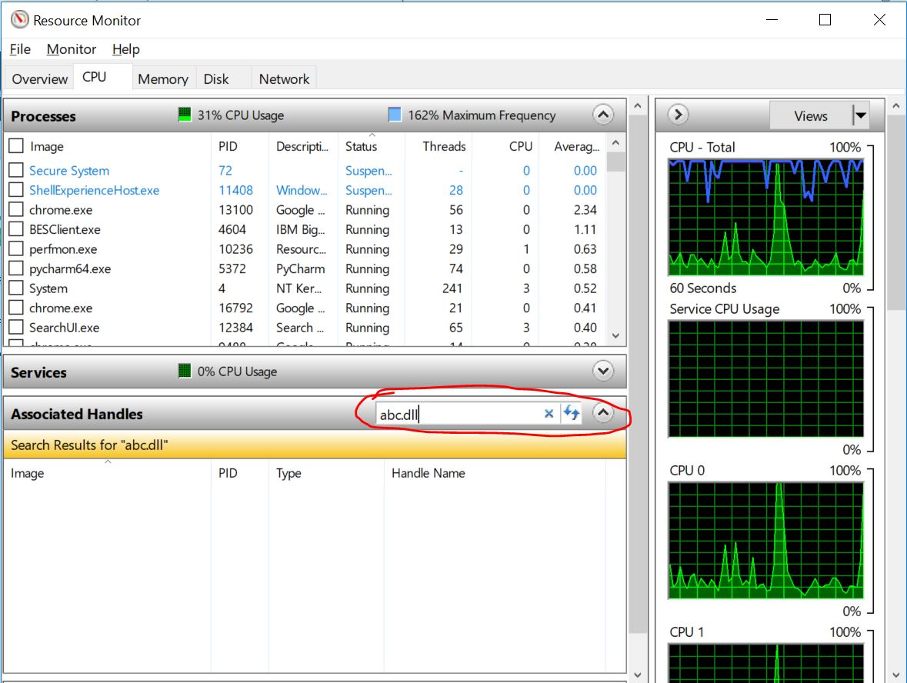

## windows 下强制删除文件
有时无法删除文件，提示 “文件正在被使用” or “文件被其他程序打开” 等等。

##### 解决方法
* 确认要强制删除的文件名称，例如： “abc.dll”。
* 搜索栏，搜索 “Task Manager”， 右键 “Run as administrator”。
* 切换到 “性能（Performance）”， 点击下部的 “资源监视器（Open Resource Monitor）”。
* 点击 “CPU”，找到下方 “关联的句柄（Associated Handles）”，搜索栏中输入要删除的文件名，点击查找并结束相关进程。
* 如遇黑屏，Ctrl+Alt+Del，点击右下角重启，然后即可删除该文件。

